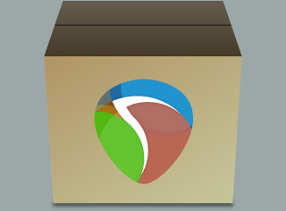
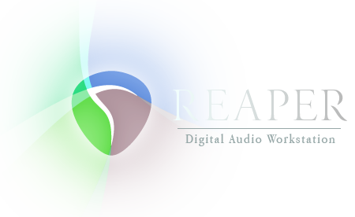

# Langpack_FR_CockosReaper

Répertoire de travail pour la traduction francophone de REAPER Cockos et des extensions SWS

Fichier à modifier:
Travail en cours=>  => WIP_REAPER_SWS_S&M-langpack-francais/REAPER_SWS_590_french.ReaperLangPack

```
https://raw.githubusercontent.com/AurelGDN/Langpack_FR_CockosReaper/master/WIP_REAPER_SWS_S%26M-langpack-francais/REAPER_SWS_590.ReaperLangPack
```
<div class="markdown-body img;"></img></div>

## Contribute / contribuer

  En principe je me charge de générer/actualiser les "template" de langpack fournis par Cockos, la traduction se coordonne en priorité sur le fil du forum officiel http://forum.cockos.com/showthread.php?t=92847
Cependant vous trouverez ici tous les outils nécessaires pour oeuvrer à la génération d'un template de langpack...
En outre, si vous n'avez pas peur de Git, les Pull Requests sont les bienvenues bien sûr. N'hésitez pas à me contacter ici ou ailleurs pour employer nos efforts de façon stratégique (inutile que l'on s'emploi à traduire 2 fois la même string...)
Vous pouvez aussi simplement faire de la relecture et proposer des corrections, améliorations.

#### Le chercher/remplacer est à manipuler avec grande précaution, souvent générateur de problème si vous avez le clic facile
#### Ne pas modifier les intitulés de section entre crochets                  ex:  [actions]
#### Ne pas modifier les intitulés de chaîne en début de ligne                 ex: 4A46D7685C3008EB=

Les commentaires de lignes ';' sont des chaînes à traduire
 Les commentaires de lignes ';^' sont des chaînes optionnelles, traduites dans la section [common] à gérer au cas par cas surtout dans l'optique d'optimiser l'affichage à l'écran des chaînes plus longues aprés traduction.

En cas de besoin il existe aussi cette fonction pour redimmensionner certaine fenêtre exemple: 5CA1E00000000000=xsc ysc
à insérer en début de section

[DLG_128] ; IDD_PREFERENCES          
5CA1E00000000000=1.4                 

[DLG_136] ; IDD_PREFS_PLAY
5CA1E00000000000=1.4

Format d'encodage UTF8 ou UTF-16 obligatoire

Page officielle https://www.cockos.com/reaper/langpack/index.php
Filière anglophone: https://forum.cockos.com/showthread.php?p=1481913#post1481913

# GDN_tools

Réalisation de quelques scripts afin de faciliter les manipulations autour de liste d'action => cf tagger_tool: remove tagg, add_tag
L'intéret étant de pouvoir utiliser la liste d'action avec des versions du Langpack plus au moins à jour et une version récente  de REAPER => la mixité Anglais/Français dans la liste d'action peut poser problème au filtrage des actions

Mise à disposition d'un lexique pour comprendre les termes choisis et aussi dans l'optique d'homogéineiser les traductions du LangpackFr

### Contributors / Contributeurs historiques depuis V4.14

#### French - Français

* Neilerua
* Jeffos
* Benf
* Zee Wavesurfer
* Homme Studio
* Transtrans
* Sardonicus
* Reno_thestraws
* Vincent Sermonne
* X-Raym
...

Et plus généralement les participants de ce fil:  
[Interface de REAPER en Français(LangPack Fr)](http://forum.cockos.com/showthread.php?t=92847)

<div class="markdown-body img;"></img></div>
<bodyclass="markdown-body pl-6">

<h1 class="markdown-body pl-sr">REAPER lexique</h1>

</div>
  <h2 class="pl-ent ">LangPack Fr </h2>
  <div class="markdown-body"></div>

  <h3 class="markdown-body pl-s">mot clé => Tag Us </h3>

<table class="markdown-body">
  <thead>
    <tr>
      <th>0</th><th>1</th><th>2</th>
    </tr>
  </thead>
  <tbody>
    <tr>
      <td> forme </td><td>shape</td><td></td>
    </tr>
    <tr>
      <td> mètre</td><td>meter</td><td></td>
    </tr>
    <tr>
      <td>E/S</td><td>I/O</td><td></td>
    </tr>
    <tr>
      <td>activer/désactiver</td><td>toggle</td><td></td>
    </tr>
    <tr>
      <td>afficher</td><td>display</td><td></td>
    </tr>
    <tr>
      <td>afficher</td><td>show</td><td></td>
    </tr>
    <tr>
      <td>afficher/cacher</td><td>toggle</td><td></td>
    </tr>
    <tr>
      <td>ajustement</td><td>trim</td><td></td>
    </tr>
    <tr>
      <td>ajuster/lire</td><td>trim/read</td><td></td>
    </tr>
    <tr>
      <td>aller</td><td>go</td><td></td>
    </tr>
    <tr>
      <td>annulation</td><td>undo</td><td></td>
    </tr>
    <tr>
      <td>annuler</td><td>undo</td><td></td>
    </tr>
    <tr>
      <td>armer/désarmer</td><td>toggle</td><td></td>
    </tr>
    <tr>
      <td>arrangement</td><td>arrange</td><td></td>
    </tr>
    <tr>
      <td>arrière plan</td><td>background</td><td></td>
    </tr>
    <tr>
      <td>augmenter</td><td>increase</td><td></td>
    </tr>
    <tr>
      <td>augmenter le volume</td><td>nudge</td><td></td>
    </tr>
    <tr>
      <td>avance rapide</td><td>forward</td><td></td>
    </tr>
    <tr>
      <td>baisser le volume</td><td>nudge</td><td></td>
    </tr>
    <tr>
      <td>bande</td><td>lane</td><td></td>
    </tr>
    <tr>
      <td>barre d'outils</td><td>toolbar</td><td></td>
    </tr>
    <tr>
      <td>battement</td><td>beat</td><td></td>
    </tr>
    <tr>
      <td>bord </td><td>edge</td><td></td>
    </tr>
    <tr>
      <td>boucle</td><td>loop</td><td></td>
    </tr>
    <tr>
      <td>bourse</td><td>pool</td><td></td>
    </tr>
    <tr>
      <td>canal</td><td>channel</td><td></td>
    </tr>
    <tr>
      <td>chaloupé</td><td>swing</td><td></td>
    </tr>
    <tr>
      <td>chaîne</td><td>chain</td><td></td>
    </tr>
    <tr>
      <td>clavier virtuel MIDI</td><td>keyboard</td><td></td>
    </tr>
    <tr>
      <td>coller</td><td>paste</td><td></td>
    </tr>
    <tr>
      <td>configuration de scène</td><td>Live Config</td><td></td>
    </tr>
    <tr>
      <td>console de projet</td><td>project bay</td><td></td>
    </tr>
    <tr>
      <td>copier</td><td>copy</td><td></td>
    </tr>
    <tr>
      <td>couloir</td><td>lane</td><td></td>
    </tr>
    <tr>
      <td>courbe de tempo</td><td>tempo map</td><td></td>
    </tr>
    <tr>
      <td>crête</td><td>peak</td><td></td>
    </tr>
    <tr>
      <td>curseur de souris</td><td>mouse cursor</td><td></td>
    </tr>
    <tr>
      <td>diminuer</td><td>decrease</td><td></td>
    </tr>
    <tr>
      <td>disposition</td><td>layout</td><td></td>
    </tr>
    <tr>
      <td>divide</td><td>diviser</td><td></td>
    </tr>
    <tr>
      <td>droit</td><td>right</td><td></td>
    </tr>
    <tr>
      <td>début</td><td>start</td><td></td>
    </tr>
    <tr>
      <td>défilement</td><td>scroll</td><td></td>
    </tr>
    <tr>
      <td>défilement</td><td>scroll</td><td></td>
    </tr>
    <tr>
      <td>défiler</td><td>scroll</td><td></td>
    </tr>
    <tr>
      <td>définir</td><td>set</td><td></td>
    </tr>
    <tr>
      <td>démarrer/arrêter</td><td>toggle</td><td></td>
    </tr>
    <tr>
      <td>déplacement</td><td>moving</td><td></td>
    </tr>
    <tr>
      <td>déplacer</td><td>move</td><td></td>
    </tr>
    <tr>
      <td>déplacer</td><td>move</td><td></td>
    </tr>
    <tr>
      <td>développement de thème</td><td>tweak</td><td></td>
    </tr>
    <tr>
      <td>empêcher</td><td>prevent</td><td></td>
    </tr>
    <tr>
      <td>en arrière</td><td>back</td><td></td>
    </tr>
    <tr>
      <td>en avant</td><td>forward</td><td></td>
    </tr>
    <tr>
      <td>en ligne"</td><td>inline</td><td></td>
    </tr>
    <tr>
      <td>enregistrement</td><td>recording</td><td></td>
    </tr>
    <tr>
      <td>enregistrer</td><td>record</td><td></td>
    </tr>
    <tr>
      <td>enveloppe</td><td>envelope</td><td></td>
    </tr>
    <tr>
      <td>envoi</td><td>send</td><td></td>
    </tr>
    <tr>
      <td>export mono</td><td>render</td><td></td>
    </tr>
    <tr>
      <td>export multicanal</td><td>render</td><td></td>
    </tr>
    <tr>
      <td>export stéréo</td><td>render</td><td></td>
    </tr>
    <tr>
      <td>faire un export</td><td>render</td><td></td>
    </tr>
    <tr>
      <td>fichier</td><td>file</td><td></td>
    </tr>
    <tr>
      <td>file d'attente des exports</td><td>render queue</td><td></td>
    </tr>
    <tr>
      <td>fin </td><td>end</td><td></td>
    </tr>
    <tr>
      <td>fondu d'entrée</td><td>fade in</td><td></td>
    </tr>
    <tr>
      <td>fondu de sortie</td><td>fade out</td><td></td>
    </tr>
    <tr>
      <td>fondu enchaîné</td><td>crossfade</td><td></td>
    </tr>
    <tr>
      <td>fondus enchaînés</td><td>crossfade</td><td></td>
    </tr>
    <tr>
      <td>forme</td><td>shape</td><td></td>
    </tr>
    <tr>
      <td>fréquence de trames</td><td>framerate</td><td></td>
    </tr>
    <tr>
      <td>gauche</td><td>left</td><td></td>
    </tr>
    <tr>
      <td>gestionnaire</td><td>manager</td><td></td>
    </tr>
    <tr>
      <td>grille</td><td>grid</td><td></td>
    </tr>
    <tr>
      <td>grosse horloge</td><td>big clock</td><td></td>
    </tr>
    <tr>
      <td>hauteur de l'objet</td><td>pitch</td><td></td>
    </tr>
    <tr>
      <td>hauteur de la prise</td><td>pitch</td><td></td>
    </tr>
    <tr>
      <td>intervertir</td><td>swap</td><td></td>
    </tr>
    <tr>
      <td>inverser</td><td>reverse</td><td></td>
    </tr>
    <tr>
      <td>lecture</td><td>play</td><td></td>
    </tr>
    <tr>
      <td>ligne de zéro</td><td>baseline</td><td></td>
    </tr>
    <tr>
      <td>lignes de grille</td><td>gridlines</td><td></td>
    </tr>
    <tr>
      <td>limier</td><td>finder</td><td></td>
    </tr>
    <tr>
      <td>lire</td><td>read</td><td></td>
    </tr>
    <tr>
      <td>magnétisme</td><td>snap</td><td></td>
    </tr>
    <tr>
      <td>marqueur</td><td>marker</td><td></td>
    </tr>
    <tr>
      <td>matrice d'export</td><td>render matrix</td><td></td>
    </tr>
    <tr>
      <td>matrice d'export de région</td><td>region render matrix</td><td></td>
    </tr>
    <tr>
      <td>matrice de groupe</td><td>grouping matrix</td><td></td>
    </tr>
    <tr>
      <td>matrice de routage</td><td>routing matrix</td><td></td>
    </tr>
    <tr>
      <td>mesure</td><td>meter</td><td></td>
    </tr>
    <tr>
      <td>modifier</td><td>edit</td><td></td>
    </tr>
    <tr>
      <td>modifieur de souris</td><td>mouse modifier</td><td></td>
    </tr>
    <tr>
      <td>modifieurs de souris</td><td>mouse modifier</td><td></td>
    </tr>
    <tr>
      <td>molette de souris</td><td>mousewheel</td><td></td>
    </tr>
    <tr>
      <td>mosaïque</td><td>comp</td><td></td>
    </tr>
    <tr>
      <td>multicanal</td><td>multichannel</td><td></td>
    </tr>
    <tr>
      <td>muter/démuter</td><td>toggle</td><td></td>
    </tr>
    <tr>
      <td>métrage </td><td>metering</td><td></td>
    </tr>
    <tr>
      <td>métronome</td><td>metronome</td><td></td>
    </tr>
    <tr>
      <td>navigateur</td><td>browser</td><td></td>
    </tr>
    <tr>
      <td>normaliser</td><td>normalize</td><td></td>
    </tr>
    <tr>
      <td>notes fantômes</td><td>trailing note</td><td></td>
    </tr>
    <tr>
      <td>nouveau</td><td>new</td><td></td>
    </tr>
    <tr>
      <td>objet</td><td>item</td><td></td>
    </tr>
    <tr>
      <td>onglet</td><td>tab</td><td></td>
    </tr>
    <tr>
      <td>ouvrir</td><td>open</td><td></td>
    </tr>
    <tr>
      <td>par lots</td><td>batch</td><td></td>
    </tr>
    <tr>
      <td>piste</td><td>track</td><td></td>
    </tr>
    <tr>
      <td>port</td><td>slot</td><td></td>
    </tr>
    <tr>
      <td>positionnement libre</td><td>free items positionning</td><td></td>
    </tr>
    <tr>
      <td>pousser</td><td>nudge</td><td></td>
    </tr>
    <tr>
      <td>prise</td><td>take</td><td></td>
    </tr>
    <tr>
      <td>projet</td><td>project</td><td></td>
    </tr>
    <tr>
      <td>propager</td><td>propagate</td><td></td>
    </tr>
    <tr>
      <td>pré-défilement</td><td>pre-roll</td><td></td>
    </tr>
    <tr>
      <td>pré-écoute "Surpasser"</td><td>latch-preview</td><td></td>
    </tr>
    <tr>
      <td>précédente</td><td>previous</td><td></td>
    </tr>
    <tr>
      <td>préférences</td><td>settings</td><td></td>
    </tr>
    <tr>
      <td>préréglage</td><td>preset</td><td></td>
    </tr>
    <tr>
      <td>préserver</td><td>preserve</td><td></td>
    </tr>
    <tr>
      <td>quantifier</td><td>quantize</td><td></td>
    </tr>
    <tr>
      <td>rangée</td><td>lane</td><td></td>
    </tr>
    <tr>
      <td>recherche</td><td>seek</td><td></td>
    </tr>
    <tr>
      <td>recherche de lecture lente</td><td>smooth seek</td><td></td>
    </tr>
    <tr>
      <td>rembobiner</td><td>rewind</td><td></td>
    </tr>
    <tr>
      <td>repères média</td><td>cues</td><td></td>
    </tr>
    <tr>
      <td>restaurer</td><td>redo</td><td></td>
    </tr>
    <tr>
      <td>retours</td><td>receive</td><td></td>
    </tr>
    <tr>
      <td>rognage</td><td>trim</td><td></td>
    </tr>
    <tr>
      <td>rogner</td><td>trim</td><td></td>
    </tr>
    <tr>
      <td>règle</td><td>ruler</td><td></td>
    </tr>
    <tr>
      <td>réduire</td><td>reduce</td><td></td>
    </tr>
    <tr>
      <td>région</td><td>region</td><td></td>
    </tr>
    <tr>
      <td>réglage</td><td>settings</td><td></td>
    </tr>
    <tr>
      <td>réglage de fenêtre</td><td>screenset</td><td></td>
    </tr>
    <tr>
      <td>régler</td><td>set</td><td></td>
    </tr>
    <tr>
      <td>réinitialiser</td><td>reset</td><td></td>
    </tr>
    <tr>
      <td>répertoire</td><td>path</td><td></td>
    </tr>
    <tr>
      <td>répéter</td><td>repeat</td><td></td>
    </tr>
    <tr>
      <td>sauter</td><td>skip</td><td></td>
    </tr>
    <tr>
      <td>sauver</td><td>save</td><td></td>
    </tr>
    <tr>
      <td>scinder</td><td>split</td><td></td>
    </tr>
    <tr>
      <td>scission</td><td>split</td><td></td>
    </tr>
    <tr>
      <td>signature rythmique</td><td>time signature</td><td></td>
    </tr>
    <tr>
      <td>signature rythmique</td><td>time signature</td><td></td>
    </tr>
    <tr>
      <td>sous-enveloppe</td><td>underlying</td><td></td>
    </tr>
    <tr>
      <td>sous-projet</td><td>subproject</td><td></td>
    </tr>
    <tr>
      <td>suivante</td><td>next</td><td></td>
    </tr>
    <tr>
      <td>supprimer</td><td>remove</td><td></td>
    </tr>
    <tr>
      <td>surpasser</td><td>latch</td><td></td>
    </tr>
    <tr>
      <td>sélect</td><td>select</td><td></td>
    </tr>
    <tr>
      <td>sélection temporelle</td><td>time selection</td><td></td>
    </tr>
    <tr>
      <td>thème</td><td>theme</td><td></td>
    </tr>
    <tr>
      <td>timebase</td><td>base temporelle</td><td></td>
    </tr>
    <tr>
      <td>toucher</td><td>touch</td><td></td>
    </tr>
    <tr>
      <td>transitoire</td><td>transient</td><td></td>
    </tr>
    <tr>
      <td>verrou</td><td>lock</td><td></td>
    </tr>
    <tr>
      <td>verrouillage</td><td>lock</td><td></td>
    </tr>
    <tr>
      <td>verrouiller/déverrouiller</td><td>toogle</td><td></td>
    </tr>
    <tr>
      <td>vignettes</td><td>label</td><td></td>
    </tr>
    <tr>
      <td>vitesse de lecture</td><td>playrate</td><td></td>
    </tr>
    <tr>
      <td>vue</td><td>view</td><td></td>
    </tr>
    <tr>
      <td>zoom arrière</td><td>zoom out</td><td></td>
    </tr>
    <tr>
      <td>zoom avant</td><td>zoom in</td><td></td>
    </tr>
    <tr>
      <td>échelloner</td><td>scale</td><td></td>
    </tr>
    <tr>
      <td>écoute</td><td>monitoring</td><td></td>
    </tr>
    <tr>
      <td>écran</td><td>screen</td><td></td>
    </tr>
    <tr>
      <td>écrire</td><td>write</td><td></td>
    </tr>
    <tr>
      <td>écrire</td><td>write</td><td></td>
    </tr>
    <tr>
      <td>édition par glissement</td><td>ripple edit</td><td></td>
    </tr>
    <tr>
      <td>élastique</td><td>stretch</td><td></td>
    </tr>
  </tbody>
</table>


</body>
</html>


